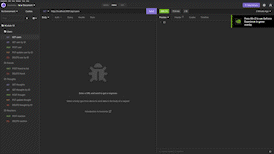

#   Challenge 14 - Social Network API

##  User Story

AS A social media startup
I WANT an API for my social network that uses a NoSQL database
SO THAT my website can handle large amounts of unstructured data

## Acceptance Criteria

GIVEN a social network API
WHEN I enter the command to invoke the application
THEN my server is started and the Mongoose models are synced to the MongoDB database
WHEN I open API GET routes in Insomnia for users and thoughts
THEN the data for each of these routes is displayed in a formatted JSON
WHEN I test API POST, PUT, and DELETE routes in Insomnia
THEN I am able to successfully create, update, and delete users and thoughts in my database
WHEN I test API POST and DELETE routes in Insomnia
THEN I am able to successfully create and delete reactions to thoughts and add and remove friends to a user’s friend list

---

# Challenge 14

## Purpose
Create an API for user's website to be able to handle unstructured data of large capacities.

## Built With
* JavaScript
* NoSQL
* Express.js
* Mongoose

---

## Process

* planned out code
* installed packages
* used module reference code
* added user, thought, and reaction files
* coded the models, controllers, and routes
* tested and fixed code
* major issues: github not pushing files and when tried pulling, lost files and had to restart
